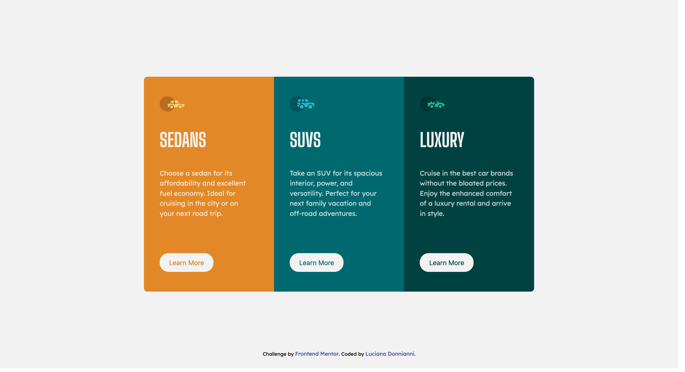

# Frontend Mentor - 3-column preview card component solution

This is a solution to the [3-column preview card component challenge on Frontend Mentor](https://www.frontendmentor.io/challenges/3column-preview-card-component-pH92eAR2-). Frontend Mentor challenges help you improve your coding skills by building realistic projects. 

## Table of contents

- [Overview](#overview)
  - [The challenge](#the-challenge)
  - [Screenshot](#screenshot)
  - [Links](#links)
- [My process](#my-process)
  - [Built with](#built-with)
  - [What I learned](#what-i-learned)
  - [Continued development](#continued-development)
  - [Useful resources](#useful-resources)
- [Author](#author)


## Overview

### The challenge

Users should be able to:

- View the optimal layout depending on their device's screen size
- See hover states for interactive elements

### Screenshot




### Links

- Solution URL: [Add solution URL here](https://your-solution-url.com)
- Live Site URL: [Add live site URL here](https://your-live-site-url.com)

## My process

### Built with

- Semantic HTML5 markup
- CSS custom properties
- SCSS
- Flexbox
- Mobile-first workflow


### What I learned

I learned to use BEM naming and SCSS to style de card and then simply change the color, and border-radius

```html
<section class="3card">
      <div class="card card--orange">
        
        <h2 class="card__car-model">Sedans</h2>
        <p class="card__car-description">Choose a sedan for its affordability and excellent fuel economy. Ideal for cruising in the city or on your next road trip.</p>
        <button class="card__btn btn--orange">Learn More</button>
      </div>
```
```css
.card--orange {
    background: $Bright-orange;
    border-radius: 8px 8px 0 0 ;
}

.card--cyan {
    background: $Dark-cyan;
}

.card--darkcyan {
    background: $Very-dark-cyan;
    border-radius: 0 0 8px 8px;
}
```


I learned to use a @mixin in order to change the behavior of the button. With this mixin all three button turn their background to transparent and their font-color to white, leaving a border.


```css
@mixin btn-bg($Very-light-gray){
    background: $Very-light-gray;

    &:hover {
        background: lighten($Very-light-gray, 10%);
    }

    &:active {
        background: transparent;
        color: $Very-light-gray;
        border: 2px solid $Very-light-gray;
    }
}
```

I use a @mixin to make the necessary changes for the desktop version.


```css
@mixin desktop {
    @media screen and (min-width: 768px) {
        @content;
    }
}
```

```css
section {
    @include desktop {
        height: 100vh;
        flex-direction: row;
        margin-top: 0;
        margin-bottom: 0;
    }

    display: flex;
    flex-direction: column;
    justify-content: center;
    align-items: center;
    margin-top: 50px;
    margin-bottom: 50px;
}
```


### Continued development

In the future projects I would like to try something with Grid, since I haven't use in any challenge yet. I will start lerning Java to emabark in more complex projects.


### Useful resources

- [Sass Tutorial for Beginners](https://www.youtube.com/watch?v=_a5j7KoflTs&t=1548s&ab_channel=freeCodeCamp.org) - I first approach on learning Sass. very complete tutorial, with a exercise to follow while making a portfolio.
- [The Block Element Modifier (BEM) Naming Convention Methodolgy](https://www.youtube.com/watch?v=u-XKw585KqY&t=121s&ab_channel=dcode) - 20 min on how to apply this naming convention.


## Author

- Frontend Mentor - [@yourusername](https://www.frontendmentor.io/profile/ldonnianni)


